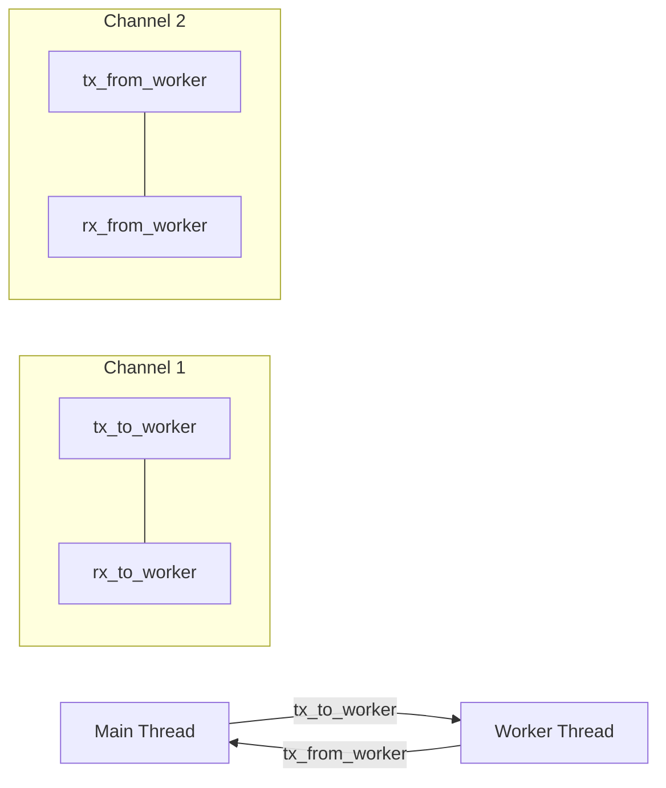

```
use std::thread;
use std::time::Duration;

thread::spawn(move || loop {
    println!("Hi from Ted the thread. I print to stdout every 1_000 ms.");
    thread::sleep(Duration::from_millis(1_000));
});
```

## mpsc
```
let (tx_to_worker, rx_to_worker) = mpsc::channel::<Vec<u8>>();
let (tx_from_worker, rx_from_worker) = mpsc::channel::<Vec<u8>>();
```
 
Let me break down this channel creation code:

In Rust, `mpsc` stands for "Multiple Producer, Single Consumer" and provides a way for threads to communicate by sending messages to each other. Let's analyze each part:

```rust
// First channel: Main thread -> Worker thread
let (tx_to_worker, rx_to_worker) = mpsc::channel::<Vec<u8>>();
// tx_to_worker: Sender - Main thread uses this to send data
// rx_to_worker: Receiver - Worker thread uses this to receive data

// Second channel: Worker thread -> Main thread
let (tx_from_worker, rx_from_worker) = mpsc::channel::<Vec<u8>>();
// tx_from_worker: Sender - Worker thread uses this to send data
// rx_from_worker: Receiver - Main thread uses this to receive data
```

Think of it like two one-way pipes:
1. First pipe (`tx_to_worker` -> `rx_to_worker`):
   - Main thread writes data using `tx_to_worker.send()`
   - Worker thread reads data using `rx_to_worker.recv()`

2. Second pipe (`tx_from_worker` -> `rx_from_worker`):
   - Worker thread writes data using `tx_from_worker.send()`
   - Main thread reads data using `rx_from_worker.recv()`

Here's a visual representation:



The `Vec<u8>` part specifies that we're sending vectors of bytes through these channels. For example:

```rust
// In main thread
tx_to_worker.send(vec![1, 2, 3])?; // Sends bytes to worker

// In worker thread
let received = rx_to_worker.recv()?; // Receives those bytes
// received would be vec![1, 2, 3]

// Worker can then send back data
tx_from_worker.send(vec![4, 5, 6])?;

// Main thread receives it
let response = rx_from_worker.recv()?; // Gets vec![4, 5, 6]
```

This setup allows for safe, concurrent communication between the threads. Some key points:
- Each channel is one-way only
- Channels are thread-safe by design
- If all Senders or all Receivers are dropped, the channel is closed
- You can clone Senders (`tx`) but not Receivers (`rx`) - that's why it's "Multiple Producer, Single Consumer"

## Questions about mpsc

1. Channel Sending Efficiency:
- By default, channels pass ownership of the data by moving it (not copying)
- For `Vec<u8>`, only the vector's metadata (pointer, length, capacity) is moved through the channel - the actual heap data isn't copied
- However, if multiple threads need access to large data, consider using `Arc` to share ownership:

```rust
// Instead of sending large data directly
tx.send(huge_vector)?;

// You could send a shared reference
let shared_data = Arc::new(huge_vector);
tx.send(Arc::clone(&shared_data))?;
```

2. Rust provides several ways to handle channel reception:

```rust
use std::sync::mpsc::{self, TryRecvError, RecvTimeoutError};
use std::time::Duration;

// 1. Blocking recv() - waits indefinitely
let value = rx.recv()?; // Blocks until data arrives

// 2. Non-blocking try_recv() - returns immediately
match rx.try_recv() {
    Ok(value) => println!("Got value: {:?}", value),
    Err(TryRecvError::Empty) => println!("No data available"),
    Err(TryRecvError::Disconnected) => println!("Channel closed"),
}

// 3. Timeout-based recv_timeout()
match rx.recv_timeout(Duration::from_secs(1)) {
    Ok(value) => println!("Got value: {:?}", value),
    Err(RecvTimeoutError::Timeout) => println!("Timed out"),
    Err(RecvTimeoutError::Disconnected) => println!("Channel closed"),
}

// 4. Iterator-based approach for multiple values
for received in rx.iter() {
    println!("Got: {:?}", received);
}

// 5. Using select! macro (requires tokio or similar async runtime)
use tokio::select;

async fn handle_channels(rx1: mpsc::Receiver<i32>, rx2: mpsc::Receiver<String>) {
    loop {
        select! {
            val = rx1.recv() => println!("Got number: {:?}", val),
            msg = rx2.recv() => println!("Got message: {:?}", msg),
        }
    }
}
```

If you need more sophisticated async handling, you might want to consider using Tokio's channels instead of std::sync::mpsc. Tokio provides async versions of channels with additional features:

```rust
use tokio::sync::mpsc;

async fn example() {
    let (tx, mut rx) = mpsc::channel(32); // With buffer size

    // Sender task
    tokio::spawn(async move {
        tx.send(42).await.unwrap();
    });

    // Receiver task
    while let Some(value) = rx.recv().await {
        println!("got = {}", value);
    }
}
```

For your specific serial port communication case, you might want to consider a hybrid approach:

```rust
use std::sync::{mpsc, Arc};
use std::time::Duration;

pub struct SerialComms {
    tx: mpsc::Sender<Vec<u8>>,
    rx: mpsc::Receiver<Vec<u8>>,
    shared_buffer: Arc<Vec<u8>>, // For large, shared data
}

impl SerialComms {
    pub fn receive_with_timeout(&self, timeout: Duration) -> Result<Vec<u8>, RecvTimeoutError> {
        self.rx.recv_timeout(timeout)
    }
    
    pub fn try_receive(&self) -> Result<Vec<u8>, TryRecvError> {
        self.rx.try_recv()
    }
    
    // For handling large shared data
    pub fn send_shared(&self, data: Arc<Vec<u8>>) -> Result<(), mpsc::SendError<Arc<Vec<u8>>>> {
        self.tx.send(Arc::clone(&data))
    }
}
```

This gives you flexibility in how you want to handle the communication:
- Use non-blocking `try_receive()` for polling
- Use timeouts for bounded waiting
- Share large data efficiently with `Arc`
- Could be extended to use async/await if needed

